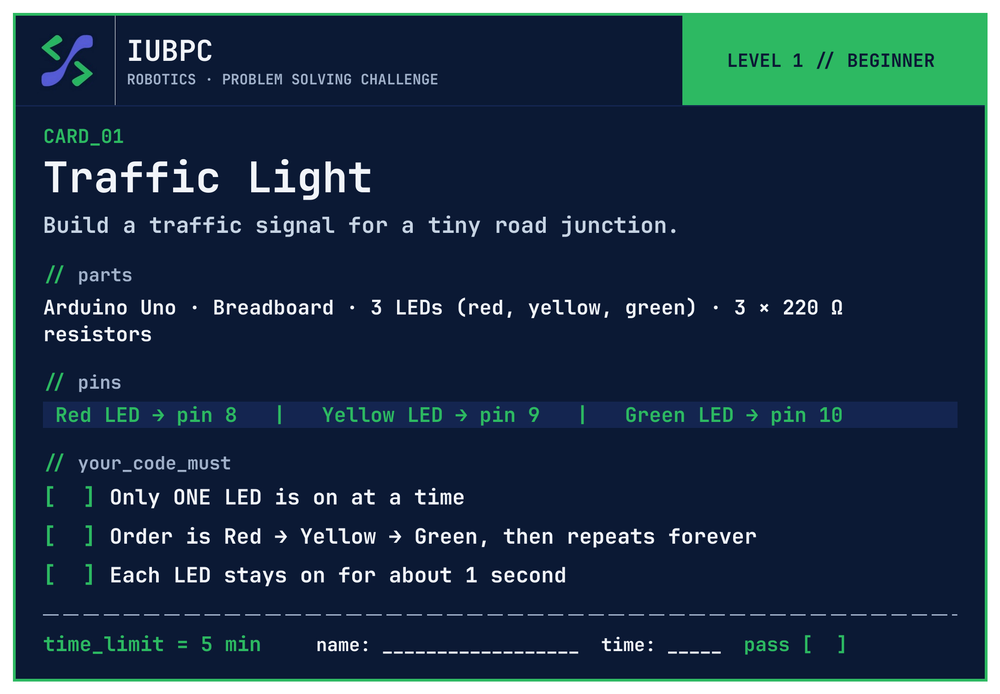
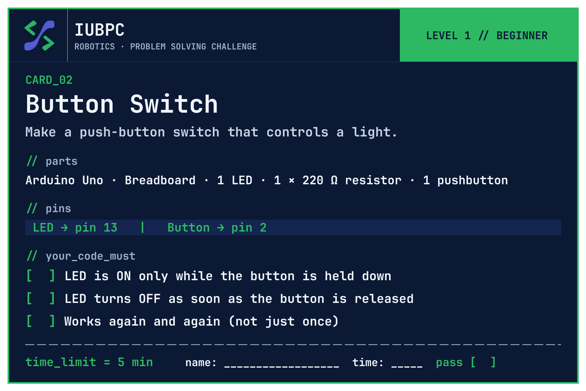
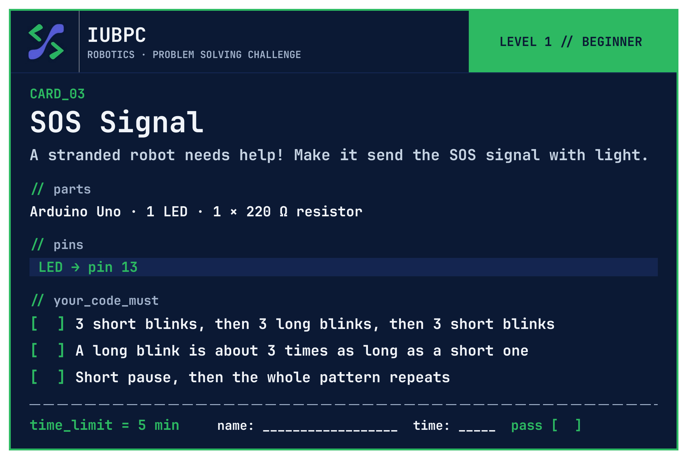
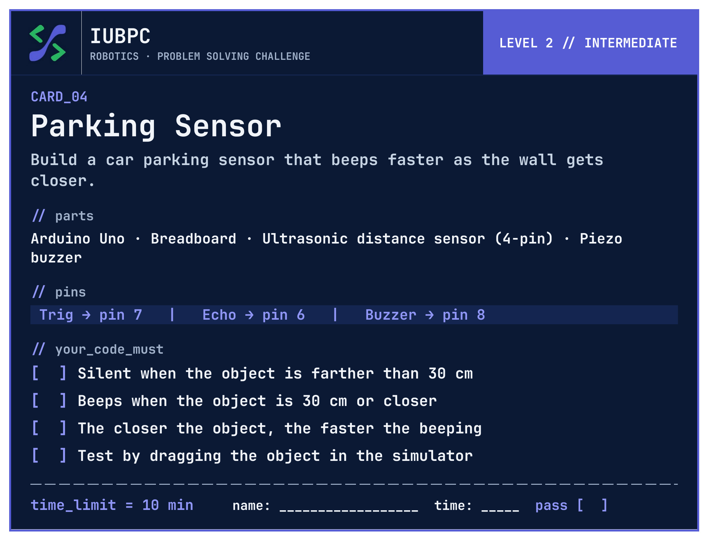
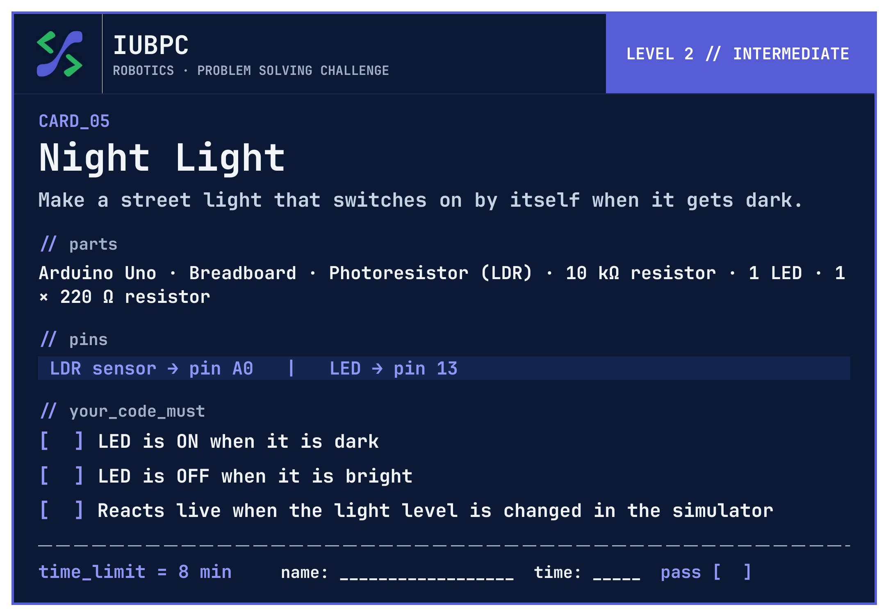
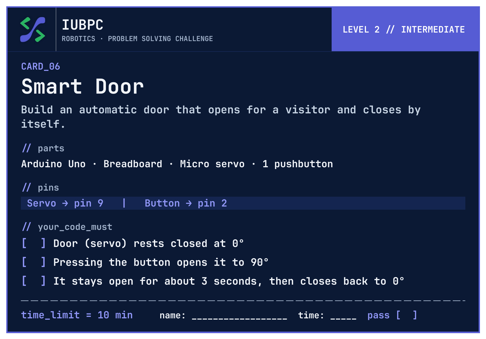
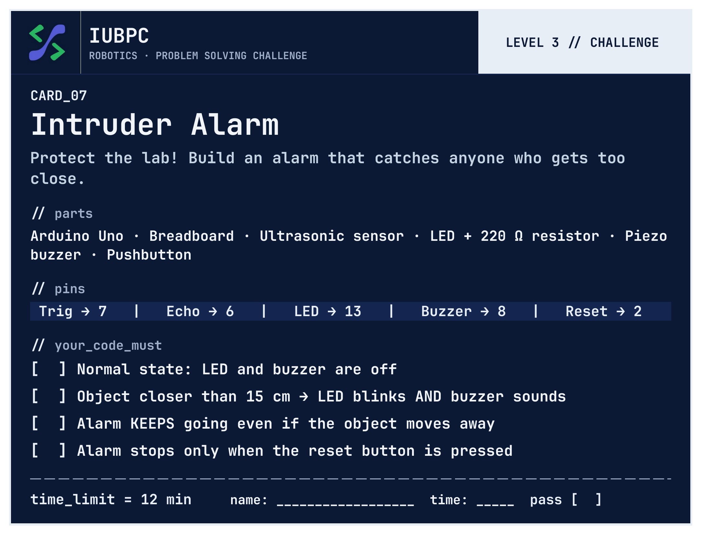
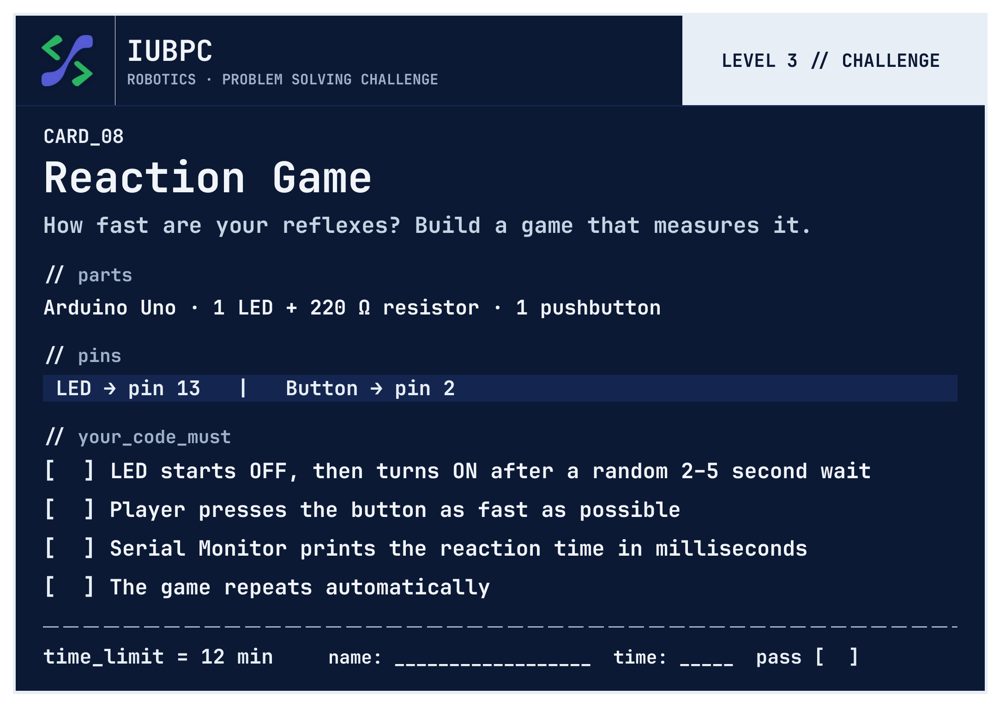
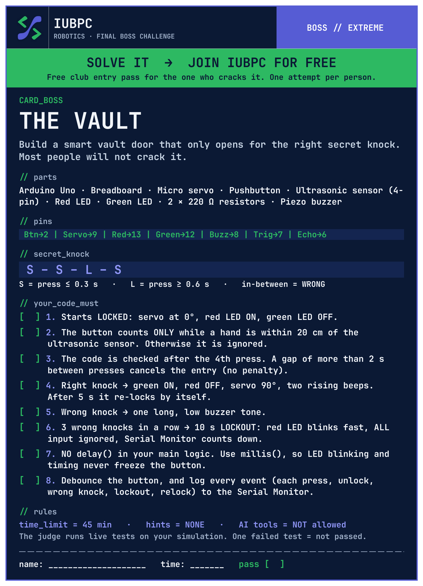

# IUBPC Robotics Challenge - Arduino Solution Code & Documentation

Welcome to the official repository for the **IUBPC Robotics Challenge**. This repository contains fully tested Arduino Uno sketches, circuit diagrams, specification documents, and high-resolution event posters for 9 hands-on robotics and electronics challenges ranging from fundamental digital output to the final Boss Vault state-machine system.

---

## 📋 Overview of Challenge Solutions

| Project # | Project Name | Main Components | Key Concepts | Code Solution | Card Diagram |
| :--- | :--- | :--- | :--- | :---: | :---: |
| **01** | **Traffic Light** | 3 LEDs (Red, Yellow, Green), Resistors | Digital output timing, state sequencing | [`.ino`](./01_Traffic_Light/01_Traffic_Light.ino) | [📷 Card](./01_Traffic_Light/01_Traffic_Light.jpg) |
| **02** | **Button Switch** | Pushbutton, Built-in LED (Pin 13) | `INPUT_PULLUP`, active-low input reading | [`.ino`](./02_Button_Switch/02_Button_Switch.ino) | [📷 Card](./02_Button_Switch/02_Button_Switch.jpg) |
| **03** | **SOS Signal** | Built-in LED / External LED | Morse code timing (`... --- ...`), modular functions | [`.ino`](./03_SOS_Signal/03_SOS_Signal.ino) | [📷 Card](./03_SOS_Signal/03_SOS_Signal.jpg) |
| **04** | **Parking Sensor** | HC-SR04 Ultrasonic Sensor, Buzzer | `pulseIn()`, distance calculation, `map()`, audio feedback | [`.ino`](./04_Parking_Sensor/04_Parking_Sensor.ino) | [📷 Card](./04_Parking_Sensor/04_Parking_Sensor.jpg) |
| **05** | **Night Light** | LDR (Light Dependent Resistor), LED | `analogRead()`, Serial debugging, threshold switching | [`.ino`](./05_Night_Light/05_Night_Light.ino) | [📷 Card](./05_Night_Light/05_Night_Light.jpg) |
| **06** | **Smart Door** | Servo Motor, Pushbutton | `Servo.h` library, PWM angular control, automated hold delay | [`.ino`](./06_Smart_Door/06_Smart_Door.ino) | [📷 Card](./06_Smart_Door/06_Smart_Door.jpg) |
| **07** | **Intruder Alarm** | HC-SR04 Sensor, Buzzer, LED, Pushbutton | State latching (armed/disarmed), multi-sensor logic | [`.ino`](./07_Intruder_Alarm/07_Intruder_Alarm.ino) | [📷 Card](./07_Intruder_Alarm/07_Intruder_Alarm.jpg) |
| **08** | **Reaction Game** | LED, Pushbutton, Serial Monitor | `millis()`, `random()`, millisecond precision timing | [`.ino`](./08_Reaction_Game/08_Reaction_Game.ino) | [📷 Card](./08_Reaction_Game/08_Reaction_Game.jpg) |
| **09 (BOSS)** | **The Vault** | Servo, HC-SR04, Buzzer, LEDs, Button | State machine (`LOCKED`, `OPEN`, `LOCKOUT`), knock code (`S-S-L-S`) | [`.ino`](./09_Boss_Vault/09_Boss_Vault.ino) | [📷 Card](./09_Boss_Vault/09_Boss_Vault.jpg) |

---

## 🗂 Repository Structure

```
IUBPC_Arduino_Solution_Code/
├── README.md                              # Main documentation & challenge overview
├── .gitignore                             # Arduino & IDE ignore configurations
│
├── 01_Traffic_Light/                      # Card 1: Traffic Light
│   ├── 01_Traffic_Light.ino
│   └── 01_Traffic_Light.jpg
├── 02_Button_Switch/                      # Card 2: Button Switch
│   ├── 02_Button_Switch.ino
│   └── 02_Button_Switch.jpg
├── 03_SOS_Signal/                         # Card 3: SOS Signal
│   ├── 03_SOS_Signal.ino
│   └── 03_SOS_Signal.jpg
├── 04_Parking_Sensor/                     # Card 4: Parking Sensor
│   ├── 04_Parking_Sensor.ino
│   └── 04_Parking_Sensor.jpg
├── 05_Night_Light/                        # Card 5: Night Light
│   ├── 05_Night_Light.ino
│   └── 05_Night_Light.jpg
├── 06_Smart_Door/                         # Card 6: Smart Door
│   ├── 06_Smart_Door.ino
│   └── 06_Smart_Door.jpg
├── 07_Intruder_Alarm/                     # Card 7: Intruder Alarm
│   ├── 07_Intruder_Alarm.ino
│   └── 07_Intruder_Alarm.jpg
├── 08_Reaction_Game/                      # Card 8: Reaction Game
│   ├── 08_Reaction_Game.ino
│   └── 08_Reaction_Game.jpg
├── 09_Boss_Vault/                         # Card 9: BOSS Challenge - The Vault
│   ├── 09_Boss_Vault.ino
│   └── 09_Boss_Vault.jpg
│
└── docs/                                  # Assets & Documentation
    ├── problem_cards/                     # Original Word specification files
    │   ├── IUBPC_Robotics_Problem_Cards_.docx
    │   └── IUBPC_Boss_Card_The_Vault.docx
    └── posters/                           # Event Posters (SVG, PNG, 4x4ft PDF)
        ├── IUBPC_Robotics_Poster_v3.svg
        ├── IUBPC_Robotics_Poster_v3_4800px.png
        └── IUBPC_Robotics_Poster_v3_4x4ft.pdf
```

---

## 🖼 Challenge Cards & Circuit Schematics

<details>
<summary><b>View All Challenge Card Visuals</b></summary>

### Card 1: Traffic Light


### Card 2: Button Switch


### Card 3: SOS Signal


### Card 4: Parking Sensor


### Card 5: Night Light


### Card 6: Smart Door


### Card 7: Intruder Alarm


### Card 8: Reaction Game


### Card 9: BOSS Challenge - The Vault


</details>

---

## 🛠 Hardware Connections Quick Reference

#### 1. Traffic Light
- **Pin 8**: Red LED | **Pin 9**: Yellow LED | **Pin 10**: Green LED

#### 2. Button Switch
- **Pin 2**: Pushbutton (`INPUT_PULLUP` to GND) | **Pin 13**: Built-in LED

#### 3. SOS Signal
- **Pin 13**: LED Output (Morse S-O-S timing cycle)

#### 4. Parking Sensor
- **Pin 7**: HC-SR04 `TRIG` | **Pin 6**: HC-SR04 `ECHO` | **Pin 8**: Piezo Buzzer

#### 5. Night Light
- **Pin A0**: LDR Divider | **Pin 13**: Night Light LED

#### 6. Smart Door
- **Pin 2**: Trigger Button (`INPUT_PULLUP`) | **Pin 9**: Servo Motor (`PWM`)

#### 7. Intruder Alarm
- **Pin 7**: HC-SR04 `TRIG` | **Pin 6**: HC-SR04 `ECHO` | **Pin 2**: Reset Button (`INPUT_PULLUP`) | **Pin 8**: Buzzer | **Pin 13**: Alarm LED

#### 8. Reaction Time Game
- **Pin A0**: Floating pin for `randomSeed()` | **Pin 2**: Reaction Button (`INPUT_PULLUP`) | **Pin 13**: Signal LED

#### 9. BOSS: The Vault
- **Pin 2**: Knock Pattern Button (`INPUT_PULLUP`) | **Pin 6**: HC-SR04 `ECHO` | **Pin 7**: HC-SR04 `TRIG` | **Pin 8**: Buzzer | **Pin 9**: Servo Lock (`PWM`) | **Pin 12**: Green LED | **Pin 13**: Red LED

---

## 📂 Event Posters & Design Assets

High-resolution printable banners and posters for the **IUBPC Robotics Challenge** are located in [`docs/posters/`](./docs/posters/):
- **Vector Source**: [`IUBPC_Robotics_Poster_v3.svg`](./docs/posters/IUBPC_Robotics_Poster_v3.svg)
- **4800px High-Res Image**: [`IUBPC_Robotics_Poster_v3_4800px.png`](./docs/posters/IUBPC_Robotics_Poster_v3_4800px.png)
- **Large Print PDF**: [`IUBPC_Robotics_Poster_v3_4x4ft.pdf`](./docs/posters/IUBPC_Robotics_Poster_v3_4x4ft.pdf)

---

## 🚀 Getting Started

1. **Clone the Repository**:
   ```bash
   git clone https://github.com/ahlam26824/IUBPC_Arduino_Solution_Code.git
   cd IUBPC_Arduino_Solution_Code
   ```

2. **Open in Arduino IDE**:
   - Open any `.ino` file inside its respective subfolder (e.g., `09_Boss_Vault/09_Boss_Vault.ino`).
   - Select Board: **Arduino Uno**.
   - Select your COM Port and click **Upload**.

3. **Serial Monitor**:
   - Open Serial Monitor at **9600 baud rate** for **05_Night_Light**, **08_Reaction_Game**, and **09_Boss_Vault** to view real-time diagnostics and state transitions.

---

## 📜 License

Created for educational and competition purposes for the **IUBPC Robotics Challenge**. Free to use and modify!
